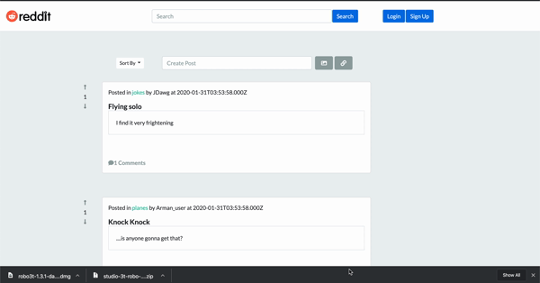

# Reddit_Clone


## Summary 
Reddit_Clone is an application that mimics the main functionality of the popular discussion forum Reddit. The goal was to use this as a challenge to understand complex database associations and how user actions on the front end magnify that complexity. On Reddit_Clone you can see the post feed upon coming to the site however until you have created an account you will be limiited to simply viewing the posts. Once an account has been created you will be able to up vote/down vote on posts, join and creat subreddits, and leave comments on individual posts. Some of the features so far are being able to sort the feed by the most popular or "upvoted" post, as well as by your own subreddits. This application also features search, where you can find individual subreddits. And of course you can create a post and comment on posts. 

## Demo
 

 
## Technologies Used
- Sequelize: Used to set relational associates in the database. Sequelize is a promise-based Node.js ORM for Postgres, MySQL, MariaDB, SQLite and Microsoft SQL Server
- MySQL: Relational database management system based on SQL – Structured Query Language, used in this applicationt to warehouse and query user information. 
- Express.js - Used for application set up of middleware for end point connection between the front end and backend.
- Node.js - Used for package managment and to execute JavaScript code to build the command line tool for server-side scripting.
- jQuery - Used for executing functions on the browser side that allow the application render user inputs.
- Moments.js - Adding date and time to user posts.
- Git - Version control system to track changes to source code
- GitHub - Hosts repository that can be deployed to GitHub Pages
 
## Code Snippet

This code snipppet features the User model. Whats interesting about this particular model is that it's using the Belongs To Many relationship and setting a target "through" the UserSub that ends up being a combination of user and sub. Belongs-To-Many associations are used to connect sources with multiple targets. These targets can also have connections to multiple sources. This is done so that we can allow for subreddits on the premise that a user can oth bcreate a subreddit, as well as join a subreddit, and we can also serve up the appropriate informaiton for a subreddit that a particular user has created. 

```js
module.exports = function(sequelize, DataTypes) {
  var User = sequelize.define("User", {
    user_name: DataTypes.STRING,
    password: DataTypes.STRING,
    first_name: { type: DataTypes.STRING, allowNull: true },
    last_name: { type: DataTypes.STRING, allowNull: true }
  });

  User.associate = function(models) {
    User.hasMany(models.Post, {
      onDelete: "cascade"
    });
    User.hasMany(models.Comment, {
      onDelete: "cascade"
    });
    User.belongsToMany(models.Sub, {
      through: "UserSub"
    });
  };
  return User;
};

```

## Built With
* [MySQL](https://www.mysql.com/)
* [Express.js](https://expressjs.com/)
* [Node.js](https://nodejs.org/en/)
* [npmjs](https://docs.npmjs.com/)
* [Inquirer](https://www.npmjs.com/package/inquirer)
* [Moments.js](https://momentjs.com/)
* [Moment-Timezone.js](https://momentjs.com/timezone/)

## Authors

**Chris Melby**
- [LinkedIn](https://www.linkedin.com/in/chris-melby-71106b126/)
- [Link to Github](https://github.com/cmelby)
- [Portfolio](https://cmelby.github.io/portfolio/)

**Arman Riahi**
- [LinkedIn](https://www.linkedin.com/in/arman-riahi/)
- [Link to Github](https://github.com/namrataffy)

